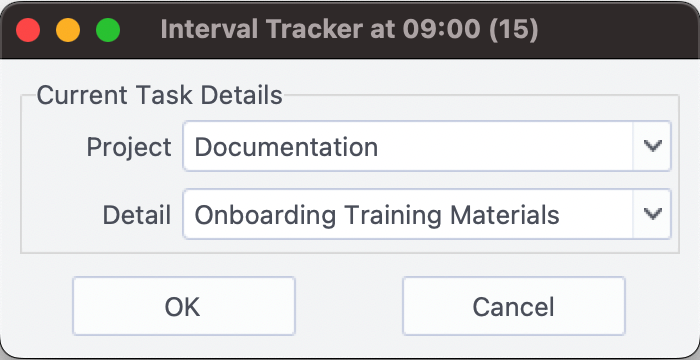

Daily Tracker
---

About
---
An application for keeping track of tasks throughout the day.

Resources
---
The clock icon is from [icons8.com](https://icons8.com/):
- https://icons8.com/icon/2YPST59G2xJZ/clock

Form UI
---
The form UI is currently built with [tkinter](https://docs.python.org/3/library/tkinter.html) and looks like:
 

Commits
---
This project uses a mix of [Conventional Commits](https://www.conventionalcommits.org/en) and [gitmojis](https://gitmoji.dev/) for its commit messages. The commit types used follow the [Angular convention](https://github.com/angular/angular/blob/22b96b9/CONTRIBUTING.md#-commit-message-guidelines) and are:
 - `build`: Changes that affect the build system, external dependencies, or CI
 - `chore`: Updating grunt tasks etc; no production code change
 - `docs`: Documentation only changes
 - `feat`: A new feature
 - `fix`: A bug fix
 - `perf`: A code change that improves performance
 - `refactor`: A code change that neither fixes a bug nor adds a feature
 - `style`: Changes that do not affect the meaning of the code (white-space, formatting, missing semi-colons, etc)
 - `test`: Adding missing tests or correcting existing tests
